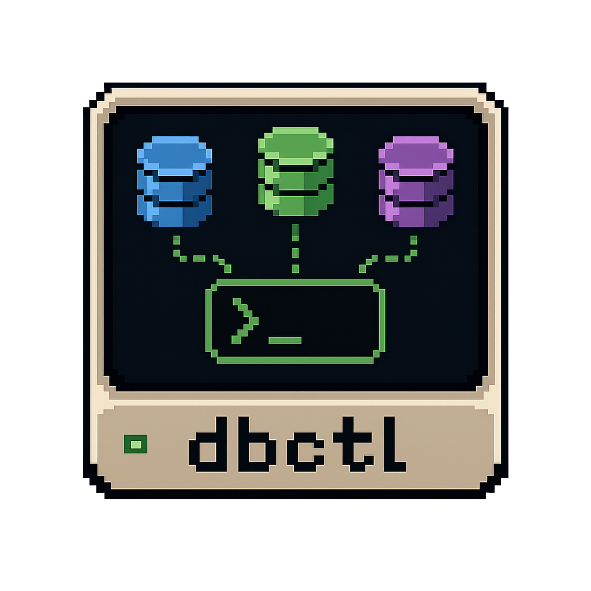

<p align="center">
  
</p>

# dbctl

`dbctl` is a small Python CLI for **monitoring, controlling, and administering
multiple databases** through a single declarative config. It is built for
operators who manage a **database explosion** — the same application deployed
across several environments (dev / test / int / prod) and several tenants
(tenant1 / tenant2 / tenant3 / …) — where administering a row means opening a GUI
client, navigating a connection tree, opening a tunnel, and clicking through
to the right schema. `dbctl` replaces that multi-click flow with one command:

```text
dbctl prod-tenant1 increase-credits alice 10 --apply     # bump a user's credits, in prod, tenant1
dbctl prod-tenant2 increase-credits alice 10 --apply     # same op, different tenant
dbctl int-tenant3  doctor                                # healthcheck integration tenant3
```

Every connection's tunnel (`ssm` / `ssh` / `k8s` / `direct`), credentials,
safety policy, and introspection queries live in one versioned
`~/.dbctl/connections.yaml`; every common SQL action lives in one
`~/.dbctl/operations.yaml`. `dbctl` synthesises one Click subcommand per
connection × operation, opens the tunnel, runs the SQL with bind parameters,
writes an audit-log entry, and tears the tunnel down — without you ever
leaving the terminal.

### Why not DBeaver / a GUI client?

| GUI client (DBeaver, etc.)                          | `dbctl`                                       |
|-----------------------------------------------------|-----------------------------------------------|
| Click through a connection tree every time          | `dbctl <conn> <op>` — one command             |
| Re-establish SSO / SSH per session, often by hand  | Tunnels auto-opened from YAML, SSO re-used    |
| Ad-hoc SQL with no audit trail                      | Every run appended to `~/.dbctl/history.jsonl` (secrets redacted) |
| "What can I run here?" is whatever you remember     | Operations are declared + versioned; `--help` lists them |
| DML is one `Ctrl-Enter` away                        | DML is **dry-run by default** until `--apply`; `--yes` skips the prompt |
| No cross-DB diff                                     | `dbctl diff user-count prod-tenant1 int-tenant1`        |

`dbctl` is **not** a schema browser or a query playground — it deliberately
has no ad-hoc query command. Declaring operations in YAML keeps "what can be
run against this DB" discoverable from a versioned file instead of buried in
your shell history. (For ad-hoc exploration open the tunnel with
`dbctl tunnel open <conn>` and point your favourite client at the local bind.)

### How it reaches a database

| type     | how                                                            | external deps |
|----------|----------------------------------------------------------------|---------------|
| `ssm`    | AWS SSM port-forward through an EC2 bastion to a private host | `aws` CLI on PATH, active SSO session |
| `ssh`    | Classic `ssh -N -L` port-forward through a bastion             | `ssh` CLI on PATH, an SSH key file |
| `k8s`    | `kubectl port-forward` to a Service / Pod in a cluster         | `kubectl` CLI on PATH, a valid kubeconfig |
| `direct` | No tunnel — connect to the upstream host:port directly        | none |

Each connection declares its SQLAlchemy URL scheme (`postgresql+psycopg`,
`mysql+pymysql`, `mariadb+pymysql`, `mssql+pyodbc`, …), a healthcheck query,
optional introspection (`info`) queries, and a `safety` policy.

Operations are declared separately in `operations.yaml`. Each operation is a
parameterised SQL block (using `$name` placeholders) with declared parameters;
`dbctl` builds one Click subcommand per operation, so every connection
automatically exposes a subcommand for every declared single-DB operation.

```text
dbctl pg add-user stephen 12 --apply
dbctl pg list-users 20
dbctl pg info row_counts
dbctl diff user-count pg my
dbctl diff compare-credits pg my Daily
dbctl doctor
dbctl history list
```

A query-only operation runs immediately. A DML operation (`mode: execute`,
`upsert`, or `script`) on a connection with `safety.confirm: true` runs as a
**dry-run by default** — it shows the resolved SQL + bound values and writes
nothing, until you pass `--apply`. `--yes` skips the final `[y/N]` confirmation.
Every run is appended to `~/.dbctl/history.jsonl` (with secret-typed
parameters redacted), and `dbctl <conn> again` re-runs the last operation with
the same params.

## Why "the operations are declarative"

There is **no ad-hoc query command**. To run SQL through `dbctl` you must
declare an operation in `operations.yaml` first — its name, its parameters
(with types, descriptions, positional vs keyword), its SQL, and its mode
(`execute` / `fetch` / `fetch_one` / `script` / `upsert` for single-DB;
`diff` / `compare` / `copy` / `sync` / `validate` / `replay` for multi-DB).
The CLI then synthesises a Click subcommand per operation, so:

- the `--help` for `<conn> <op>` is generated from the declared parameters;
- parameters are type-checked before the SQL is ever rendered;
- secret-typed parameters are identified for audit redaction;
- the audit log is queryable by operation name (`dbctl history list`).

This keeps "what can be run against this DB" discoverable from a versioned
config file, instead of buried in shell history.

## Install (uv)

`uv` is the recommended workflow:

```bash
# Install dbctl as a tool (all dialect drivers ship as dependencies)
uv tool install .

# Or hack locally:
uv sync --extra dev
uv pip install -e .
uv run dbctl --help
```

The `aws` and `ssh` binaries are expected on `PATH`. No `boto3`, no
`paramiko` — dbctl always shells out so you keep your existing SSO session,
key agents, and MFA flows.

## Quick start with the bundled docker-compose fleet

> **First time here?** Follow the [step-by-step tutorial](docs/tutorial.md)
> instead — it walks through install, the dashboard, single-DB operations,
> the audit log, multi-DB diff, writing your own operation, and pointing
> `dbctl` at real AWS RDS via SSM.

`docker-compose.yml` brings up three databases (postgres on `:5433`, mysql on
`:3307`, mssql on `:1434`) with the same four-table schema (`users`, `credits`,
`usage`, `logs`) and slightly different sample data — perfect for trying the
multi-connection modes.

```bash
docker compose up -d

# install the sample config (uses plaintext passwords out of the box for dev;
# swap to `password_env: VARNAME` or `prompt: true` for real environments)
mkdir -p ~/.dbctl
cp .dbctl/connections.yaml ~/.dbctl/connections.yaml
cp .dbctl/operations.yaml  ~/.dbctl/operations.yaml

dbctl                                  # dashboard
dbctl doctor                           # healthcheck all three

dbctl pg health
dbctl pg info row_counts
dbctl pg list-users 10
dbctl pg add-user stephen 12 --show-sql        # dry-run (prints SQL)
dbctl pg add-user stephen 12 --apply --yes     # commit (no prompt)
dbctl pg increase-credits alice 10 --apply -y    # +10% on alice's credits

# multi-DB modes (operation-first, preferred since v0.6):
dbctl user-count pg my                        # multi-DB diff
dbctl compare-credits pg my Daily
dbctl table-counts pg my                      # auto-gen SELECT COUNT(*) per table
dbctl copy-users pg my --dry-run              # simulate src → trg copy
dbctl sync-users pg my --dry-run              # report insert/update/delete counts
dbctl validate-schema pg my                   # detect column/type drift
dbctl replay-users pg my --dry-run            # copy with a per-row transform
# deprecated verb-first aliases still work:
dbctl diff user-count pg my

dbctl pg history                               # per-connection audit log
dbctl pg again                                 # re-run last op on pg

dbctl tunnel open pg                           # hold tunnel for ad-hoc psql
```

> SQL Server needs an installed ODBC driver on the host (`ODBC Driver 18 for
> SQL Server`). The sample `ms` connection is `read_only: true` so it can be
> used for `diff` / `validate` / `table-counts` but not for `copy` / `sync` /
> `replay` (which write to the target).

## Config layout

```text
~/.dbctl/
├── connections.yaml     # named connections (ssm / ssh / direct)
├── operations.yaml      # parameterised SQL operations (single + multi)
└── history.jsonl        # audit log (one JSON event per run)
~/.dbctl/profiles/<name>/ # switch config dir with --profile <name>
```

`dbctl init` walks you through adding a new connection interactively and
writes it back to `~/.dbctl/connections.yaml` — it will test the tunnel +
healthcheck before saving (for `direct` connections).

### Loader resilience

Each connection is validated **independently**, not as one big
`ConnectionsFile`. A mis-configured connection (e.g. a reference template
with all password sources commented out, or a typo'd driver) is skipped with
a one-line warning on stderr — the rest of the registry still loads so the
dashboard, `--help`, and the good connections keep working:

```
connections.yaml: 1 invalid connection skipped:
  pg-ssm: set 'password', 'password_env' or 'prompt: true' for each connection
```

`dbctl operations validate` checks `operations.yaml` the same way.

## Adding an operation

Operations are global — every connection sees them. Declare one:

```yaml
# ~/.dbctl/operations.yaml
operations:
  reset-credits:
    description: "Reset a user's daily credits back to their yearly baseline"
    scope: single
    mode: execute
    confirm: true
    parameters:
      - { name: name,   type: string,  required: true, position: 1, description: "User name" }
      - { name: floor,  type: integer, default: 10,   position: 2, description: "Don't reset below this floor" }
    sql: |
      UPDATE users
         SET credits_daily = GREATEST($floor, credits_yearly / 365)
       WHERE name = $name
```

Then:

```bash
dbctl pg reset-credits alice --show-sql        # preview
dbctl pg reset-credits alice --apply --yes     # commit
```

`$name` and `$floor` are rewritten to SQLAlchemy bind-params (`:name`,
`:floor`) — they are always parameterised, never string-interpolated, so SQL
injection through a parameter value is not possible. The Postgres cast idiom
`$name::type` is rewritten to the portable `CAST(:name AS type)` form so the
same operation YAML works cross-dialect:

```yaml
sql: |
  SELECT level, COUNT(*) AS events
    FROM logs
   WHERE created_at >= $since::timestamp     # → CAST(:since AS timestamp)
     AND created_at <  $until::timestamp
   GROUP BY level
```

(For *dynamic identifiers* such as table names, write one operation per table
for now; `${var}` identifier interpolation is on the v2 roadmap.)

See [`docs/operations.md`](docs/operations.md) for the full parameter and
mode reference.

## Adding a connection

Edit `~/.dbctl/connections.yaml`, or run `dbctl init`:

```yaml
connections:
  prod-pg:
    description: "Production main Postgres (private RDS, SSM tunnel)"
    aliases: [prod]
    type: ssm
    driver: postgresql+psycopg
    database: app
    username: app_admin
    password_env: DBCTL_PROD_PG_PASSWORD
    ssm:
      region: eu-west-1
      profile: prod                              # AWS SSO profile; tokens cached in ~/.aws/cache
      bastion_instance_id: i-0abcd1234            # or use bastion_tags: { Name: bastion-prod }
      remote_host: mydb.xxxx.eu-west-1.rds.amazonaws.com
      remote_port: 5432
      local_port: 0                               # 0 = auto-pick a free port
    healthcheck: { query: "SELECT 1" }
    info:
      - name: row_counts
        query: "SELECT relname, n_live_tup FROM pg_stat_user_tables ORDER BY n_live_tup DESC LIMIT 10"
    safety:
      confirm: true        # dry-run-by-default for DML
      read_only: false
      allowed_operations: []   # empty = any
```

See [`docs/connections.md`](docs/connections.md) for the full reference.

## Safety model

Each connection has a `safety` block:

| field               | effect                                                                  |
|---------------------|-------------------------------------------------------------------------|
| `confirm: true`     | DML ops print resolved SQL + dry-run **unless `--apply`** is passed. `--yes` skips the final prompt. |
| `read_only: true`   | Blocks every DML op (execute / upsert / script) entirely.               |
| `allowed_operations`| Whitelist of operation names; empty list = all allowed.                 |

`dbctl` **confirms before opening the transaction** — saying `N` at the
prompt leaves the database untouched.

DB password sources are mutually exclusive — pick **one** per connection:

| source          | use |
|-----------------|------|
| `password: "…"`     | plaintext (local dev only). Don't commit real secrets. |
| `password_env: VAR` | read from the named environment variable. Recommended for any shared/CI host. |
| `prompt: true`      | prompt for the DB password interactively each run. Good for break-glass access. |
| `windows_sso: true` | mssql+pyodbc only: Windows Integrated Security (`Trusted_Connection=yes`). No username/password needed. |
| `url: "…"`          | full SQLAlchemy URL (overrides all the above). Use for Azure AD, ODBC-specific kwargs, or any non-standard connection string. |

Secret-typed **operation** parameters (`type: secret`) are redacted in the
audit log regardless of which DB password source the connection uses.

## Shell completion

```bash
dbctl --install-completion bash         # prints the snippet
echo 'eval "$(_DBCTL_COMPLETE=bash_source dbctl)"' >> ~/.bashrc
# similarly for zsh / fish
```

Completion then covers connection names, operation names, and multi-DB
operation names (`dbctl <op> <TAB>` lists connections; `dbctl diff <TAB>`
lists the deprecated verb-first aliases).

## Project layout

```text
dbctl/
├── pyproject.toml          # uv / hatchling; ruff + pytest + mypy config
├── docker-compose.yml      # postgres :5433, mysql :3307, mssql :1434
├── seed/                   # four-table schema + sample data for the fleet
├── .dbctl/                 # sample connections.yaml + operations.yaml
├── docs/
│   ├── connections.md      # connections.yaml reference
│   ├── operations.md       # operations.yaml reference
│   └── DESIGN.md           # architecture and design decisions
└── dbctl/
    ├── cli.py              # dynamic groups + per-op Click commands
    ├── config.py           # pydantic v2 models
    ├── connections.py      # loader + alias resolution + "did you mean?"
    ├── operations.py       # loader + scope filter
    ├── tunnels/{ssm,ssh,direct}.py
    ├── db.py               # URL builder + password resolution + healthcheck
    ├── execute.py          # $name → :name, mode routing, bind_params
    ├── multi.py            # multi-DB orchestration: diff / compare / copy / sync / validate / replay
    ├── reports.py          # rich tables / json / csv / yaml + diff + copy/sync/validate rendering
    ├── audit.py            # history.jsonl
    ├── runtime.py          # opened_conn() ctx-mgr (tunnel+engine+healthcheck)
    └── init.py             # dbctl init wizard
```

## Development

```bash
uv sync --extra dev
make help            # list all Makefile targets
make check           # lint + unit tests (the pre-commit gate)
make test            # unit tests (~80 tests, in-memory SQLite, no docker)
make typecheck       # mypy strict (pre-existing debt; non-blocking)
make smoke           # docker compose up + dbctl doctor against the fleet
make build           # wheel + sdist via uv
```

The unit tests use an in-memory SQLite database so they run without docker.
For a live end-to-end smoke test, `docker compose up -d` and follow the
[quick start](#quick-start-with-the-bundled-docker-compose-fleet) above.

## Roadmap

- `mode: script` (multi-statement support beyond single-statement passthrough)
- `diff.strategy: table_counts` introspected-intersection variant (`*`)
- Multi-file operations loader (`.dbctl/operations/<name>.yaml`)
- Dynamic identifier interpolation (`${var}`) for table/column names in diff ops
- Bidirectional `sync` with conflict arbitration (current `sync` is src → trg only)
- Tag-based operation filtering (`dbctl pg --tag user-mgmt <op>`)
- SSH agent / MFA support surfacing through the existing `ssh` subprocess

---

<p align="center">
  
</p>

## License

MIT